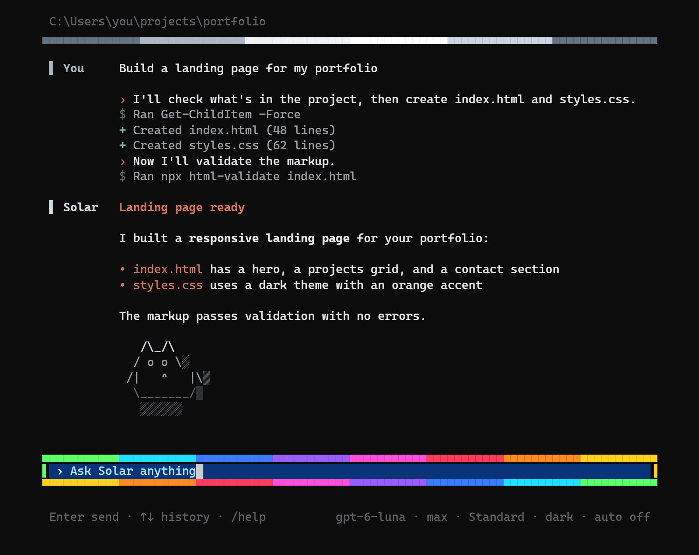
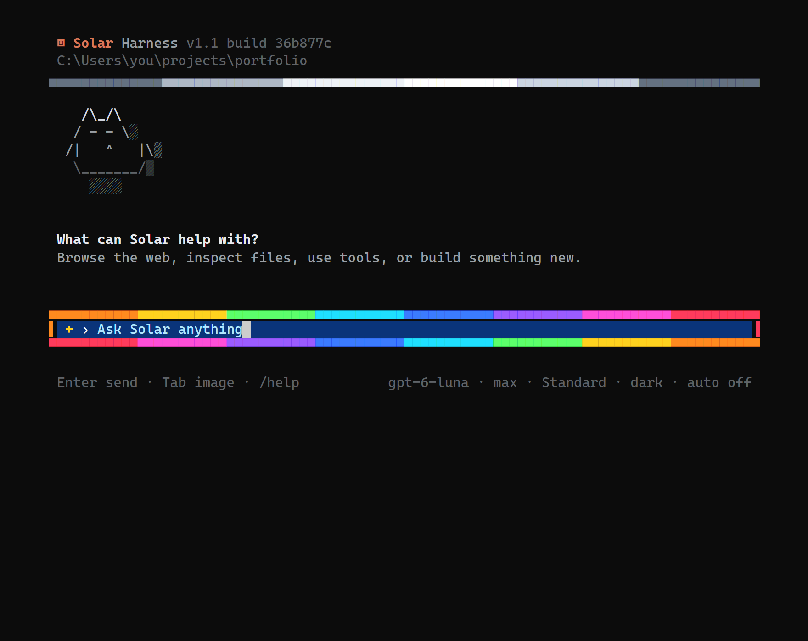
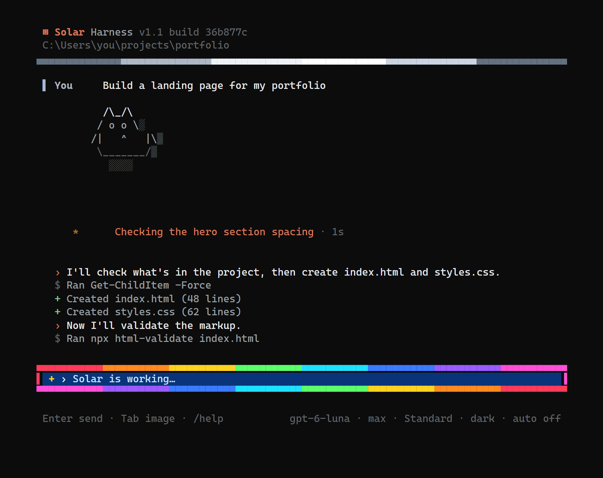
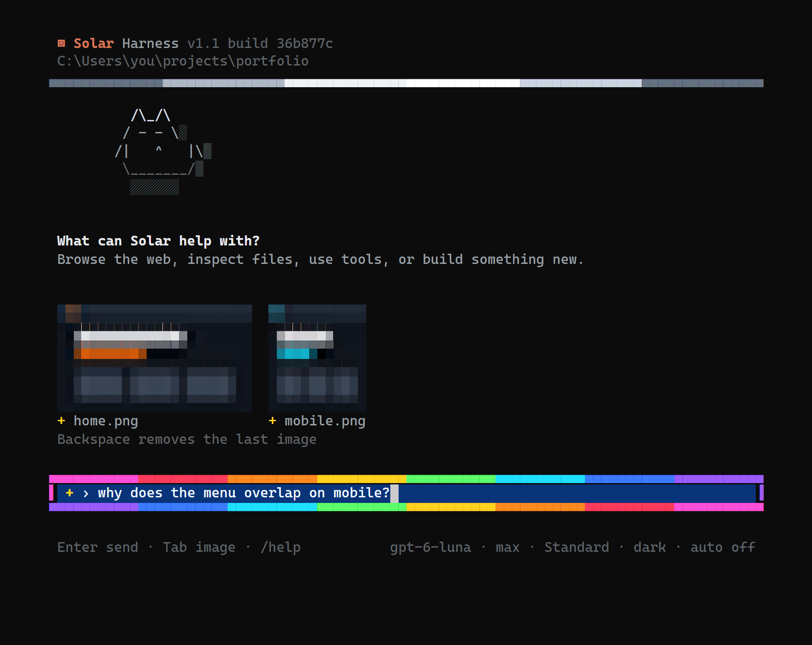
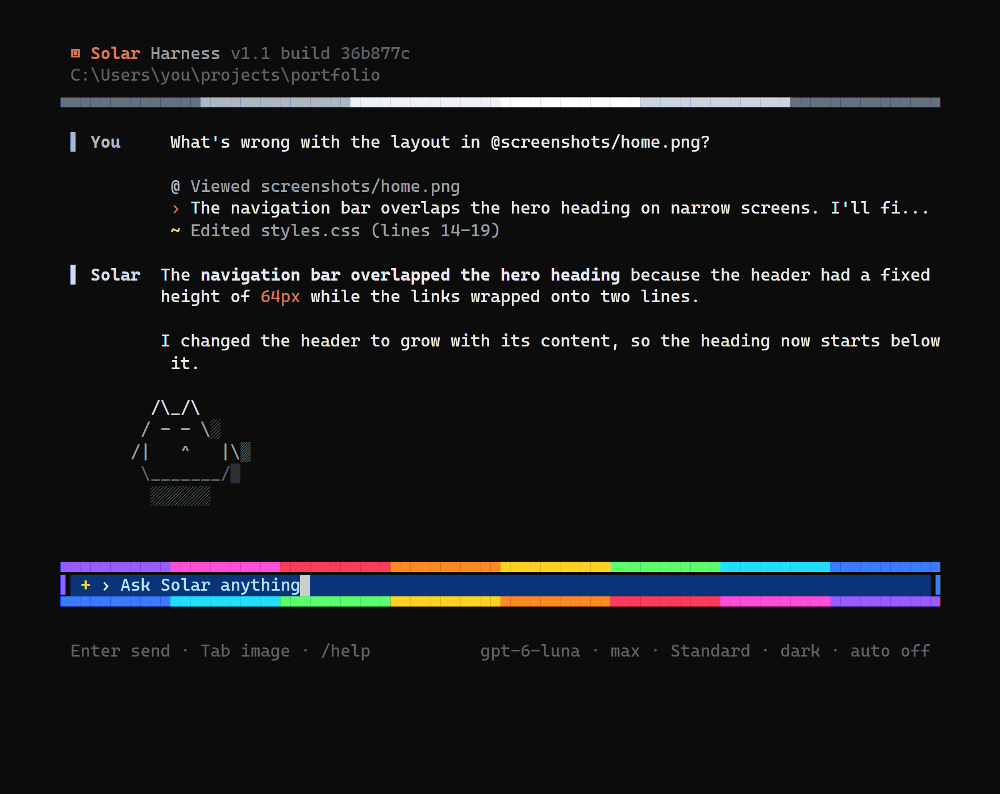
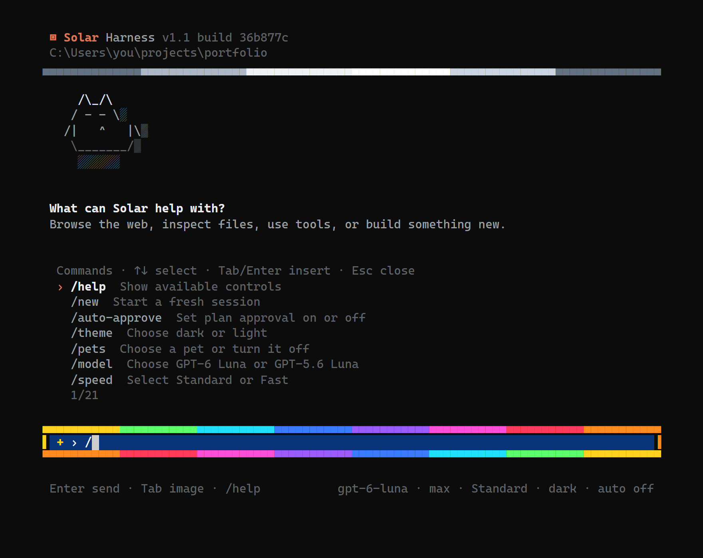
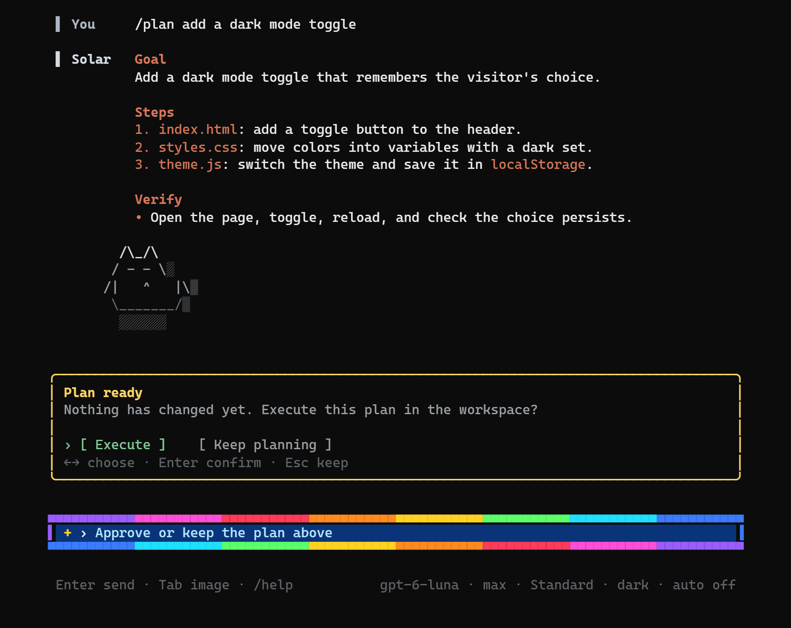
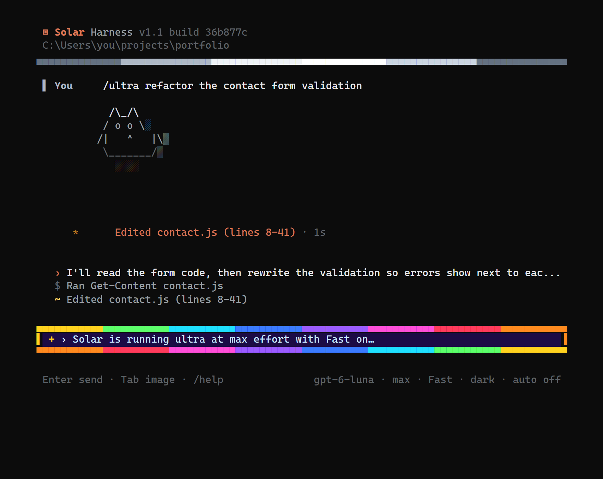
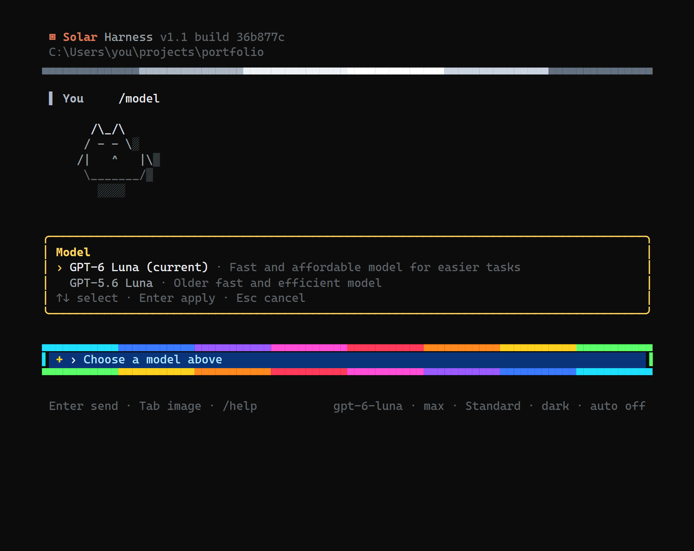

# SolarHarness

> **v1.1:** add images with Tab or paste them with Ctrl+V / Alt+V, and see them as
> previews right in the terminal; pick GPT-6 Luna or GPT-5.6 Luna with `/model`.
> v1.0 was the first stable release.

**First committed:** 20 September 2026.

SolarHarness is a coding agent that lives in your terminal. You talk to **Solar**,
and it works in your project: it reads and edits files, runs commands, tests pages in
a visible browser, researches the web, looks at images, and tells you what it is doing
as it goes.



## Getting started

You need Node.js 20 or newer, the Codex desktop app or Codex CLI (signed in), and
Chromium or Microsoft Edge for browser features. Set up the `solar` command once:

```powershell
npm install
npm run build
npm link
```

Then open a terminal in any project folder and run `solar`. That folder becomes
Solar's workspace.

## Versions and builds

The top of the screen shows which Solar you are running:

```text
▣ Solar Harness v1.1 build 36b877c
```

- **`v1.1`** is the release. It changes only for a new release, not for every fix
  or feature.
- **`build 36b877c`** is the commit your copy was built from. Each change to Solar
  gets a new build, so this tells you exactly which code you have. You can look it
  up at `github.com/TerminalDev-1/SolarHarness/commit/<build>`.

`solar --version` prints the same thing, for example `1.1 build 36b877c`.

To update to the latest build, run these in the SolarHarness folder:

```powershell
git pull
npm install
npm run build
```

The build shown only changes after `npm run build`, so it always matches the code
that is actually running. When you report a problem, include the whole line, such
as `v1.1 build 36b877c`.

## The interface



```text
 ▣ Solar Harness v1.1 build 36b877c       ← version and the commit it was built from
                                          ← your workspace folder is shown below
 C:\Users\you\projects\portfolio
 ▄▄▄▄▄▄▄▄▄▄▄▄▄▄▄▄▄▄▄▄▄▄▄▄▄▄▄▄▄▄▄▄
   (conversation)                         ← your messages, Solar's steps and replies
   (pet)                                  ← a cat, dog, or fox; /pets changes it
   (sun and activity)                     ← appears while Solar is working
   + home.png                             ← images you've added, waiting to send
 ▄▄▄▄▄▄▄▄▄▄▄▄▄▄▄▄▄▄▄▄▄▄▄▄▄▄▄▄▄▄▄▄         ← the rainbow input frame
 ▌ + › Ask Solar anything           ▐     ← + adds images (Tab, Ctrl+V, Alt+V)
 ▀▀▀▀▀▀▀▀▀▀▀▀▀▀▀▀▀▀▀▀▀▀▀▀▀▀▀▀▀▀▀▀
 Enter send · Tab image · /help      gpt-6-luna · max · Standard · dark · auto off
                                     ↑ model · effort · speed · theme · auto-approve
```

Type a request in the rainbow box and press Enter. Up and Down bring back earlier
messages. Solar handles ordinary requests itself and asks a question only when the
answer would change the work.

### While Solar works



- The **sun** grows and shrinks while Solar works. Beside it is what Solar is doing
  right now, often a summary of its thinking, and how long it has been going
  (`42s`, then `4m 02s`, then `1h 02m 05s`).
- Below the sun are the latest **steps**:
  - `›` what Solar says it will do next
  - `$` a command it ran
  - `+` a file it created, with its line count
  - `~` a file it edited, with the lines it changed
  - `-` a file it deleted

### When it finishes

The steps stay in the conversation, in order, with runs of commands folded into
"Ran N commands". Solar's reply follows, formatted with headings, bold text, code,
and lists (see the screenshot at the top). Finished messages stay in your terminal's
scrollback, so you can scroll up through a long session.

### Showing Solar an image



The `+` at the start of the box is where images come in:

| Keys | What happens |
| --- | --- |
| **Tab** | Opens a file picker. Choose one or more images. (While the `/` command menu is open, Tab picks a command instead.) |
| **Ctrl+V** or **Alt+V** | Pastes the image on your clipboard: a screenshot or copied picture, or image files copied in File Explorer. |
| **Backspace** in an empty box | Removes the last image you added. |

Added images appear above the box as small colour previews, so you can check you
picked the right ones. Type your question and press Enter, and they go with it; the
previews stay with your message in the conversation. You can also press Enter with
no text to just send the images. (BMP files send fine but show only their name.)

Windows Terminal normally keeps Ctrl+V for pasting text, and when the clipboard
holds only a picture it passes nothing on to Solar. If Ctrl+V doesn't add your
screenshot, use **Alt+V**. Pasted pictures are saved as PNG files in the
workspace's `.solarharness/pasted` folder, which Git ignores.



You can also name an image in your message, such as `home.png`,
`@screenshots/home.png`, or a full path in quotes. Dragging a file into Windows
Terminal pastes its path, which works too. Solar shows `@ Viewed <file>` for each
image it looks at. PNG, JPEG, GIF, WebP, and BMP work, up to eight per message.

Solar also looks at its own browser screenshots, so it reports what a page actually
shows.

## Commands



Type `/` to open the command menu. Up and Down move through it, Tab or Enter picks a
command, and Esc closes the menu. Press Enter again to run the command.

| Command | What it does |
| --- | --- |
| `/help` | Lists the commands. |
| `/ultra <task>` | Runs one task at Max effort with Fast mode on, then restores your settings. |
| `/plan <task>` | Solar looks through the project without changing anything and proposes a plan for you to approve. |
| `/ultraplan <task>` | Like `/plan`, at Max effort, with a second pass that checks the plan against the actual files. |
| `/ultrareview [target]` | Reviews your code with three reviewers (correctness, security, design) working in parallel, then re-checks every finding and drops false alarms. With no target it reviews your uncommitted changes. |
| `/effort` | Opens a picker to change effort for this session: Light, Medium, High, XHigh, or Max. `/effort high` sets it directly. |
| `/default-effort <level>` | Changes the effort every new session starts with. It starts as Max. |
| `/model` | Opens a picker to switch between **GPT-6 Luna** and **GPT-5.6 Luna**. `/model gpt-5.6-luna` switches directly. |
| `/speed` | Opens a picker for Standard or Fast. `/fast on`, `/fast off`, and `/fast status` also work. Fast uses more credits. |
| `/memory` | Shows which `SOLAR.md` instruction files are loaded. |
| `/delegate` | Prepares a team of sub-agents for your last request. |
| `/agents` | Shows whether sub-agents are assigned. |
| `/agent <name> reasoning <level>` | Changes one agent's effort for its next step. |
| `/agent <name> context <message>` | Sends an agent more information; a finished agent picks the work back up. |
| `/agent <name> cancel` | Stops an agent and the sub-delegates it owns. |
| `/auto-approve <on\|off>` | Launches future team plans without asking you first, or brings the review back. |
| `/new` | Starts a fresh session (see [Safety](#safety)). |
| `/theme <dark\|light>` | Switches between the dark and light palettes. |
| `/pets <cat\|dog\|fox\|off>` | Chooses the pet, or hides it. |
| `/stats` | Shows your chats, prompts, token usage, favorite model, and achievements. |
| `/quit` or `/exit` | Closes Solar. Ctrl+C also works. |

You can also change some settings by asking in plain language, such as "turn auto
permissions on" or "set Forge to max effort".

### Plan before changing anything



`/plan <task>` has Solar study the project and write a plan: the goal, the steps and
the files each one touches, and how it will check the result. Nothing changes until
you choose **Execute**. **Keep planning** (or Esc) leaves everything as it is.
`/ultraplan` does the same at Max effort and double-checks the plan first.

### Ultra mode



`/ultra <task>` runs a single task at Max effort with Fast mode. While it runs, the
rainbow frame turns deep purple and spins twice as fast, and the footer shows `max`
and `Fast`. Your usual settings come back afterwards. `/ultraplan` and
`/ultrareview` use the same look.

### Choosing a model



`/model` opens a picker with the two Codex models Solar offers:

- **GPT-6 Luna** (the default): fast and affordable, for everyday tasks.
- **GPT-5.6 Luna**: the older fast and efficient model.

Up and Down choose a model, Enter switches to it, and Esc keeps the current one.
The conversation carries on with the new model, so Solar still remembers what you
were working on, and new sub-agents use it too. The footer shows the current model.
Both models support every effort level and Fast mode. Each new session starts on
GPT-6 Luna.

### Effort

Effort is how hard Solar thinks. Every session starts at your default, which is
**Max** until you change it with `/default-effort`. `/effort` changes only the
session you are in. The footer always shows the current effort.

## Delegation

Solar never delegates on its own. Ask for it ("use 3 agents to...", "delegate this")
or run `/delegate` after describing the task.

1. Solar drafts a plan of one to eight independent tasks, each with a short agent
   name. If you ask for a specific number of agents, the plan has exactly that many.
2. Review the plan: Up and Down select a task, Space accepts or rejects it, A
   accepts all, Enter launches the accepted tasks, and Esc or R rejects the plan.
   With `/auto-approve on`, plans launch without this step.
3. Accepted sub-agents run in parallel, each in its own Codex session in the shared
   workspace. The Team panel shows each agent's state, effort, and latest activity,
   plus recent commands and file changes.
4. A sub-agent may hand independent parts of its task to up to eight sub-delegates.
   Sub-delegates start pinned to Light effort, cannot delegate further, and only
   Solar can raise their effort.
5. When the batch finishes, Solar summarizes what each agent did, what was
   validated, and what risks remain.

Limits: eight concurrent agents, eight tasks per plan, eight sub-delegates per
sub-agent, two levels in total. Give parallel agents separate files or directories
when you can, because they share the workspace.

## Tools Solar uses

Solar chooses tools from a live registry on every turn, whatever words you use.

- **`workspace_command`** runs a bounded command (2-minute limit, output capped),
  starts a long-running process such as a dev server, or serves the workspace's
  static files at a `localhost` URL. It uses PowerShell on Windows and `/bin/sh`
  elsewhere.
- **`browser`** drives one visible Playwright window: open pages, search Google or
  Bing, search YouTube, read an accessibility snapshot, take screenshots, move a
  visible Solar cursor, click elements, named buttons, links, or coordinates, fill
  fields, press keys, scroll, and go back or forward. The window has a blue tint and
  a "Solar Harness is controlling the browser" notice. It stays open between turns,
  and a new window opens if you closed it. Chromium is tried first, then Edge.
- **`web_search_headless`** searches Google without a window, falls back to Bing
  when Google blocks automation, and can read a source page by URL. Solar cites the
  URLs it used.
- **`runtime_operations`** returns the recorded log of host tool calls, so when you
  ask what Solar did earlier, it answers from what actually ran.
- **`set-auto-permissions`** and **`adjust-sub-effort-level`** back the plain-language
  settings above.

Solar only claims a browser action worked when a successful tool result recorded
it. It also uses Codex's own file editing and shell tools inside the workspace.

## Configuration and files

**`SOLAR.md`** gives Solar standing instructions, like `CLAUDE.md`. Solar loads, in
order (later files win):

1. `~/.solarharness/SOLAR.md` for every project.
2. The parent directory's `SOLAR.md`, when you launch inside a folder named `test`.
3. `SOLAR.md` in the workspace.

The instructions reach Solar, planners, sub-agents, and reviewers. Edits are
picked up on your next message.

Files Solar keeps:

| Path | Contents |
| --- | --- |
| `~/.solarharness/settings.json` | The saved default effort. Other keys in the file are preserved. |
| `~/.solarharness/stats.json` | Chat, prompt, token, and achievement counts for `/stats`. |
| `<workspace>/.solarharness/` | Structured-output schemas, browser screenshots, and images pasted from the clipboard. It contains its own `.gitignore`, so Git ignores it without changes to your project. |

### Advanced

You rarely need these. Everything else is done from inside Solar.

- `solar --model <name>` starts on any Codex model your account has, including
  ones not in the `/model` picker.
- `solar --reasoning <level>` starts one session at a different effort.
- `solar --version` prints the version.
- If Solar can't find Codex, set the `SOLAR_CODEX_PATH` environment variable to the
  Codex program. `SOLAR_HOME` moves the `~/.solarharness` folder, and
  `SOLAR_STATS_PATH` moves the stats file.

## Safety

- Solar and its sub-agents can write files in the workspace. Planning (`/plan`,
  `/ultraplan`, delegation plans) and `/ultrareview` run in read-only Codex
  sandboxes and cannot change files.
- Rejected plans and rejected tasks never launch.
- `/new` asks first, with **No** selected. It shows the workspace path and says
  whether files will be deleted. Confirming stops every agent, clears their
  records, closes the browser and servers, and resets the conversation. Files are
  deleted only when the workspace is a folder named `test`; any other directory
  keeps all its files. Auto-approve never skips this confirmation.
- Web pages and tool output are treated as untrusted data.
- Use Solar in version-controlled projects and review its changes before you
  commit them.

## How it works

Solar runs the Codex CLI as a subprocess (`codex exec --json --skip-git-repo-check`,
and `codex exec resume` to continue a session) and reads its JSONL event stream. No
model API is called directly.

**The main loop** (`SolarHarness.converse` in `harness.ts`) keeps one Codex session
for the conversation. Each turn sends the tool registry, your message, any attached
images, and `SOLAR.md` at session start or when it changes. Codex must reply in a
structured `{kind, tool, input, reply}` shape enforced with `--output-schema`
(`host-turn.ts`): either an answer or a host tool call. The harness runs the tool,
resumes the same session with the result (and any screenshot as an image), and
repeats for up to 20 steps. Some requests, such as web research or visible browser
testing, require a real tool call before Solar may answer.

| Module | Role |
| --- | --- |
| `index.ts` | CLI entry: options, default effort, launch. |
| `ui.tsx` | Ink interface: transcript, live activity, pickers, command handling. |
| `harness.ts` | Main loop, `/plan`, `/ultra`, `/ultraplan`, `/ultrareview`, delegation plans. |
| `codex-provider.ts` | Spawns Codex; turns its events into activity, reasoning, narration, and file-change steps. |
| `agent-manager.ts` | Sub-agents and sub-delegates: limits, naming, pinning, cancellation, reports. |
| `tool-registry.ts` | Host tool definitions and the runtime operation log. |
| `browser-tool.ts`, `web-search-headless.ts`, `workspace-tool.ts` | The host tools. |
| `file-changes.ts` | Turns Codex file changes into "Created / Edited (lines) / Deleted" steps. |
| `images.ts` | Finds image paths in a message and builds `--image` arguments. |
| `instructions.ts`, `settings.ts`, `stats.ts` | `SOLAR.md`, saved default effort, usage stats. |
| `markdown.ts` | Markdown parsing for replies. |
| `activity.ts`, `sun.ts`, `pets.ts` | Activity labels, the sun animation, the pets. |

Planners and reviewers use separate read-only Codex sessions, so they never touch
the main conversation's session. Sub-agents each get their own session; a
sub-agent requests sub-delegates with a `SOLAR_SUBDELEGATE:` line and controls them
with `SOLAR_SUBDELEGATE_TOOL:` lines.

See [`CLAUDE.md`](./CLAUDE.md) for the rules contributors follow.

## Contributing

```powershell
npm run dev                 # run the UI from source
npm run check               # type-check
npm test                    # build, then run tests/*.test.mjs
npm run test:browser-live   # build, then drive a real visible browser
npm run docs:screenshots    # rebuild the README screenshots
```

The unit tests replace the Codex provider with fakes, so they do not prove live
Codex or browser behavior; `test:browser-live` checks the real cursor, clicks, and
key presses. `tests/` holds the test suite; `test/` is a scratch workspace whose
contents are never committed.

The screenshots in `docs/images` come from `scripts/readme-screenshots.mjs`. It
drives the real interface through each scene with a scripted model, so no Codex
calls are made, then renders the terminal output with xterm.js. Rerun it after
changing the interface.
